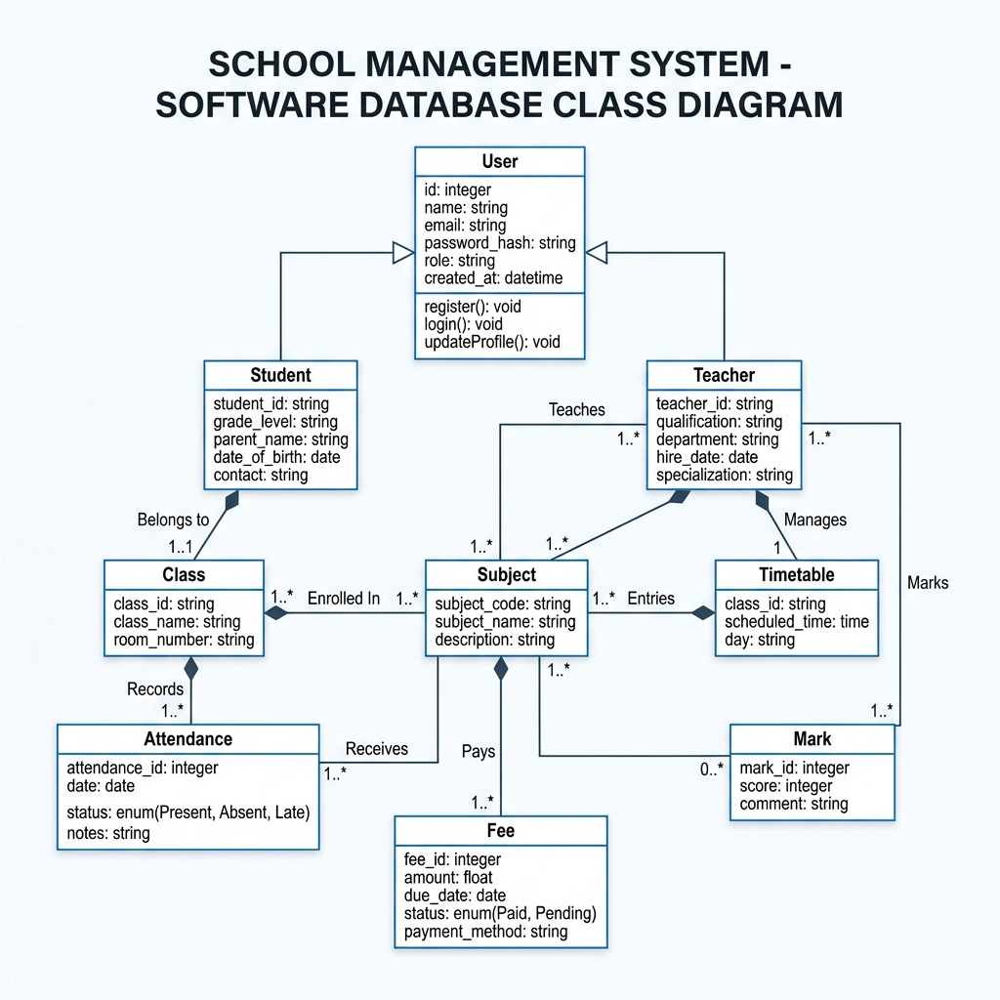
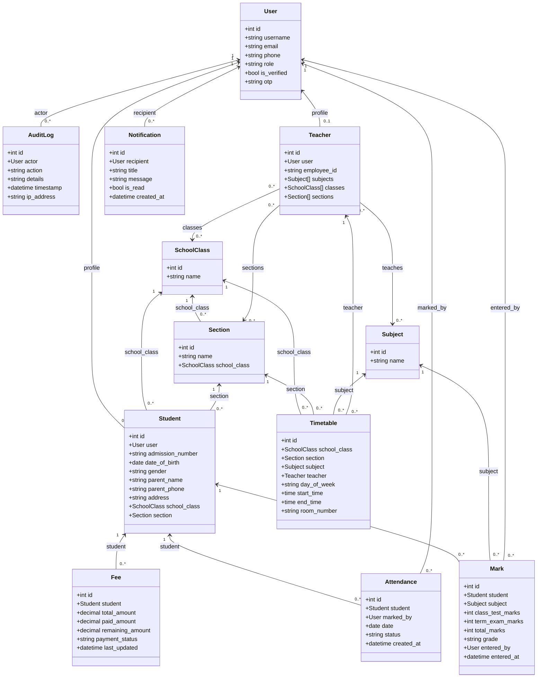

# Academix Pro: School Management System

Academix Pro is a modern, high-performance School Management System designed with role-based dashboard widgets, conflict-free timetable scheduling, daily attendance registries, and grade report cards.

🌐 **Live Demo Website:** [https://school-frontend-3sl7.onrender.com/](https://school-frontend-3sl7.onrender.com/)

---

## 🚀 Key Features

* **Role-Based Access Control (RBAC)**:
  * **Admin**: Manage the school directory (classes, sections, subjects, teachers, and students), view fees ledgers, and check daily attendance/grade reports.
  * **Teacher**: Mark attendance for assigned classes, input student exam marks, and view registry details.
  * **Student**: View personalized timetables, download/print auto-generated report cards, and view outstanding tuition fees.
* **Timetable Scheduler**: A conflict-free greedy scheduler allocating 1,800+ slots based on class and teacher availability constraints.
* **Auto-Generated Report Cards**: Direct PDF-printable report card generation for students showing mid-term, final, and cumulative percentages.
* **Tuition Fees Ledger**: System to log tuition payments, calculate remaining balances, and flag payment statuses (paid, partial, pending).
* **Automated Data Seeding**: Populates the database with 1,200+ students, 60+ teachers, 6,000+ attendance records, and 18,000+ grade sheets.

---

## 🛠️ Technology Stack

* **Frontend**: React.js (Vite), Axios, Single Page Router routing, HSL tailored CSS variables.
* **Backend**: Django, Django REST Framework, Simple JWT (JSON Web Tokens).
* **Database**: SQLite (Local Dev), PostgreSQL hosted on Neon (Production).
* **Server & Nginx**: Gunicorn WSGI, Nginx reverse proxy routing `/api/` and `/admin/` requests.
* **Containerization**: Docker & Docker Compose orchestrating frontend and backend containers.
* **PaaS Hosting**: Render (Web Service for backend, Static Site for frontend).

---

## 🏛️ System Architecture

The following diagram represents the core architecture, data sync flow, and the interaction of newly implemented frontend/backend upgrades (Toasts, Skeletons, and Audit Logs logging hooks):

```mermaid
graph TD
    subgraph Client [React Frontend (Vite)]
        UI[User Interface]
        TC[ToastContext / notifications]
        SL[Skeleton Loaders]
        DB[Dashboard / SVG Trends Chart]
        PR[Profile Settings]
        AL[Audit Logs Viewer]
    end

    subgraph Server [Django Backend]
        API[DRF API views / JWT auth]
        LH[Logging Hooks]
        MOD[Models: User, AuditLog, Student, Teacher, Attendance, Mark]
    end

    subgraph Storage [Databases]
        NEON[(Neon PostgreSQL - Production)]
        SQLITE[(SQLite - Local Fallback)]
    end

    UI -->|User Interactions / JWT Auth| API
    API -->|Logs Operations| LH
    LH -->|Create Log Entry| MOD
    API -->|Fetch/Update Data| MOD
    MOD -->|Sync Prod| NEON
    MOD -->|Sync Dev| SQLITE
```

---

## 📊 Database Schema (Class Diagram)

The following class diagram represents the core database models, their fields, and relationships:



### Mermaid Text Representation


---

## 🔐 Login Credentials (For Testing)

A complete list of all 1,265 registered test accounts is exported in [credentials.csv](./credentials.csv). Here are the primary accounts to test each role:

| Role | Email / Login | Password | Capabilities |
| :--- | :--- | :--- | :--- |
| **Admin** | `snigdha@test.com` | `admin123` | View Reports, Manage Timetables/Registry, Audit Fees. |
| **Teacher** | `teacher_1@school.com` | `teacher123` | Mark Attendance, Add Exam Marks, View own classes. |
| **Student** | `student_1@school.com` | `student123` | View Timetable, View Fees, View/Print Report Card. |

---

## 💻 Running the Project Locally

### Option A: Running with Docker Compose (Recommended)
Make sure Docker Desktop is running on your machine, then run:
```bash
docker compose up --build
```
Once the containers build, open **[http://localhost/](http://localhost/)** in your browser.

### Option B: Running natively (Without Docker)

#### 1. Backend Setup:
```bash
cd backend
python -m venv venv
# Activate virtualenv (Windows PowerShell: venv\Scripts\Activate.ps1)
pip install -r requirements.txt
python manage.py migrate
python manage.py runserver
```

#### 2. Frontend Setup:
```bash
cd frontend
npm install
npm run dev
```

---

## 🌐 Cloud Deployment
For instructions on deploying the application to the live internet using Render (PaaS) or a VPS (virtual private server), please refer to the detailed [deployment_guide.md](./deployment_guide.md).
